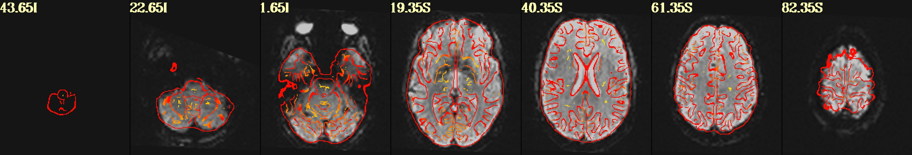
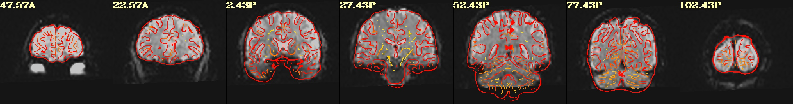
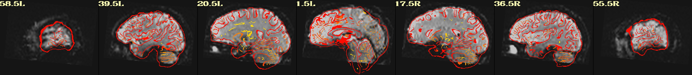

## About

This repository provides sample data to evaluate different methods for displaying 3D coregistration results using outlines. A primary step of brain imaging analyses is to align different images, for example aligning low resolution functional scans  (e.g. example_func.nii.gz) to match high-resolution anatomical scans from the same individual (highres.nii.gz). These coregistration procedures can generate unacceptable results in many instances, including poor starting estimates, different coverage, and non-linear differences between the two images. Therefore, providing tools that allow visual inspection of these spatial transforms is a vital quality assurance (QA) step. Commonly, one of the images is shown as an outline on top of the other. Here we evaluate several QA algorithms with a single dataset. The dataset is provided to allow others to develop improved algorithms.

## FSL

The FSL utility [slicer](https://fsl.fmrib.ox.ac.uk/fsl/fslwiki/Miscvis) creats the default outlines the FEAT coregistration. Since this tool has minimal documentation and is not open source, the method used is unclear. It seems to create single voxel thick (skeleton) edges, but the default settings are not always ideal.

```
slicer example_func2highres highres -s 2 -x 0.35 sla.png -x 0.45 slb.png -x 0.55 slc.png -x 0.65 sld.png -y 0.35 sle.png -y 0.45 slf.png -y 0.55 slg.png -y 0.65 slh.png -z 0.35 sli.png -z 0.45 slj.png -z 0.55 slk.png -z 0.65 sll.png ; pngappend sla.png + slb.png + slc.png + sld.png + sle.png + slf.png + slg.png + slh.png + sli.png + slj.png + slk.png + sll.png example_func2highres1.png ; slicer highres example_func2highres -s 2 -x 0.35 sla.png -x 0.45 slb.png -x 0.55 slc.png -x 0.65 sld.png -y 0.35 sle.png -y 0.45 slf.png -y 0.55 slg.png -y 0.65 slh.png -z 0.35 sli.png -z 0.45 slj.png -z 0.55 slk.png -z 0.65 sll.png ; pngappend sla.png + slb.png + slc.png + sld.png + sle.png + slf.png + slg.png + slh.png + sli.png + slj.png + slk.png + sll.png example_func2highres2.png ; pngappend example_func2highres1.png - example_func2highres2.png example_func2highres.png; /bin/rm -f sl?.png example_func2highres2.png
```


## AFNI

The [@chauffeur_afni](https://afni.nimh.nih.gov/pub/dist/doc/program_help/@chauffeur_afni.html) and [@djunct_edgy_align_check](https://afni.nimh.nih.gov/pub/dist/doc/program_help/@djunct_edgy_align_check.html) scripts can create edge maps using [3dedge3](https://afni.nimh.nih.gov/pub/dist/doc/htmldoc/programs/3dedge3_sphx.html). While the code appears to be a derivation of the Sobel function, in practice it the default settings do a nice job outlining meaningful edges.
```
@djunct_edgy_align_check                            \
    -ulay              example_func2highres.nii.gz  \
    -olay              highres.nii.gz               \
    -box_focus_slices  highres.nii.gz               \
    -use_olay_grid     NN                           \
    -prefix            img_AEAC
```





## MRIcroGL

Recent versions (since v1.2.20210909) can create edge maps using the `Find Edges` command from the `Options` button or with the `dog()` scripting function. This applies a basic [Difference of Gaussian](https://en.wikipedia.org/wiki/Difference_of_Gaussians) filter. The filter Gaussians with a FWHM of 2.5mm and 4mm (matching the [typical thickness](https://www.pnas.org/content/97/20/11050) of the human cortex, with [K~1.6](https://en.wikipedia.org/wiki/Difference_of_Gaussians) approximating the [Laplacian of Gaussian](https://en.wikipedia.org/wiki/Blob_detection#The_Laplacian_of_Gaussian).

```
import gl
gl.resetdefaults()
gl.loadimage('highres.nii.gz')
gl.overlayload('example_func2highres.nii.gz')
gl.dog(1)
gl.opacity(1,0)
gl.colorbarposition(0)
gl.mosaic("A 0.35 0.45 0.55 0.65; S 0.35 0.45 0.55 0.65; C  0.35 0.45 0.55 0.65")
```


## niimath

[niimath](https://github.com/rordenlab/niimath) can create an edge map using the same method as MRIcroGL:

```
niimath example_func2highres -clamp 0 -uclamp 100 -dog1 2 4 funcEdge
```